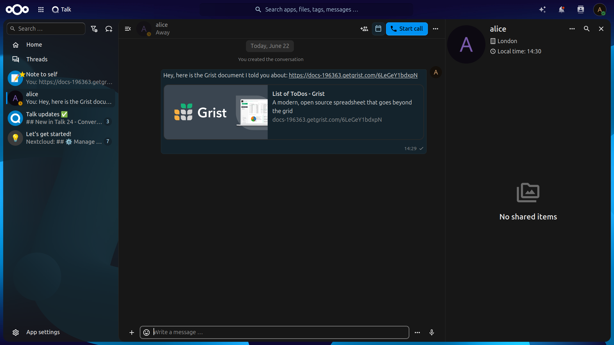

# SPDX-FileCopyrightText: 2026 Nextcloud GmbH and Nextcloud contributors
# SPDX-License-Identifier: AGPL-3.0-or-later

# Grist Integration 

The Grist integration connects Nextcloud to a self-hosted or vendor-hosted Grist account, providing a 
	unified search provider and a smart picker component for documents.

## Settings
The connection is configured in the "Connected Accounts" personal settings section. You'll need the URL of your Grist instance and an API that can be created in the Profile settings of your Grist account.